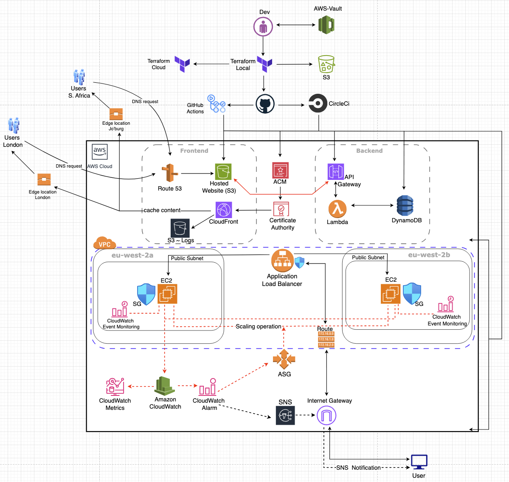

# IaC with Terraform

## End-to-End Infrastructure Provisioning in AWS

## Introduction

Faced with a brief hiatus from active AWS work, I proactively sought to bridge the knowledge gap as the cloud is evolving fast and updates are done frequently. To achieve this, I undertook the creation of a static web page for my resume, capitalizing on this project to not only refresh my memory on core AWS services but also to investigate and experiment with novel functionalities and approaches within the cloud platform.

I also created a [multi-AZ VPC with resources](https://github.com/appwebtech/IaC-with-Terraform/tree/vpc-infra/vpc-infra). This is because I deployed a Tetris web app in EC2 which spanned two AZ's in eu-west-2 region (*eventually I nuked the instances as I got a CloudWatch alarm that my AWS bill had hit the threshold I was tracking. Spinning another environment is as easy as running `terrform apply`*).

## The Project

I used Terraform to automate the whole process, below is the architecture diagram.

### Stacks and Implementations

| Stacks  | Implementation  |
|---|---|
|  Main frontend | HTML, CSS and a bit of JS (*spaghetti code for ad-hoc functionalities*) |
| [CloudFront](https://aws.amazon.com/cloudfront/)  | A [CDN](https://en.wikipedia.org/wiki/Content_delivery_network) for caching data globally |
| [AWS S3](https://aws.amazon.com/s3/)  | Hosting static web page  |
| [ACM](https://aws.amazon.com/certificate-manager/)  | For public and private SSL/TLS certificates    |
| Backend  | [Lambda](https://aws.amazon.com/pm/lambda/), [API Gateway](https://aws.amazon.com/api-gateway/) (*for relaying requests between frontend and database*) and [DynamoDB](https://aws.amazon.com/dynamodb/) (*NoSQL key-value database for persisting data*) |
| [CloudWatch](https://docs.aws.amazon.com/AmazonCloudWatch/latest/monitoring/WhatIsCloudWatch.html)  | Automate the bootstrapping of AMIs, instances with Autoscali group during scaling operations  |
| ALB  | Load balancer to distribute load within subnets across AZs |
| SNS  | To get notifications eg via email when scaling operations are triggered  |
| [Route53](https://aws.amazon.com/route53/)  | Domain registrar, DNS hosting, routing and records management  |
| [VPC](https://docs.aws.amazon.com/vpc/latest/userguide/what-is-amazon-vpc.html)  | A logically isolated virtual network in AWS Cloud, similar to [Azure VNet](https://learn.microsoft.com/en-us/azure/virtual-network/virtual-networks-overview) or GCP's [VPC network](https://cloud.google.com/vpc/docs/vpc) |
| GitHub Actions  | CI/CD pipeline for running tests when code is pushed to GitHub branches. Project tests can be found [here](https://github.com/appwebtech/IaC-with-Terraform/actions). |
| [Terraform Cloud](https://app.terraform.io/session)  | Storage of [state files](./asset-files/TF-cloud-3.png) after speculative plans are applied in Terraform.  |
| Terraform Cloud job runs | CI/CD visibility capabilities for [resource provisioning](./asset-files/TF-cloud-1.png) at a [granular](./asset-files/TF-cloud-2.png) level. |
| [CircleCi](https://circleci.com/)  | An enterprise CI/CD platform with in-depth capabilities than GitHub Actions. [Deployment](./asset-files/CI-CD_1.png), [visibility](./asset-files/CI-CD_2.png) and [customization](./asset-files/CI-CD_3.png) are much more granular. |
| Deployed Static Webpage (Resume)  | [Joseph Mwania Resume](https://josephmwania.com/)  |
